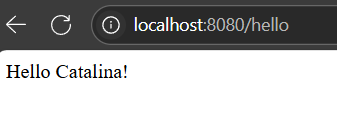
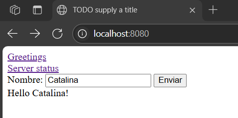

Juan Sebastian Velandia Pedraza
25/06/2025
Spring con html y JS
# JsyHtml - Spring Boot Web Example

Este proyecto es un ejemplo simple de una aplicación web usando Spring Boot. Permite enviar un nombre a través de un formulario HTML y recibir un saludo como respuesta, tanto recargando la página como usando JavaScript para evitar la recarga.

## Requisitos

- Java 8 o superior
- Maven

## Ejecución

1. Clona el repositorio o descarga el código fuente.
2. Compila y ejecuta la aplicación:

   ```sh
   mvn spring-boot:run
   ```

3. Accede a la aplicación en tu navegador:

   ```
   http://localhost:8080/hello.html
   ```

## Funcionalidad

- **Formulario con recarga:**  
  El formulario envía el nombre por POST a `/hello` y recarga la página mostrando el saludo.




- **Formulario sin recarga (AJAX):**  
  El formulario usa JavaScript para enviar el nombre por POST a `/hello` y muestra la respuesta sin recargar la página.
  

## Estructura de archivos

```
src/
 └─ main/
     ├─ java/
     │   └─ edu/escuelaing/arsw/WebSiteController.java
     └─ resources/
         └─ static/
             └─ hello.html
```

## Endpoints

- `GET /status`  
  Devuelve el estado del servidor en formato JSON.

- `GET /hello?name=Nombre`  
  Devuelve un saludo usando el nombre enviado.

- `POST /hello`  
  Devuelve un saludo usando el nombre enviado por formulario.

## Créditos

Desarrollado para la asignatura ARSW.